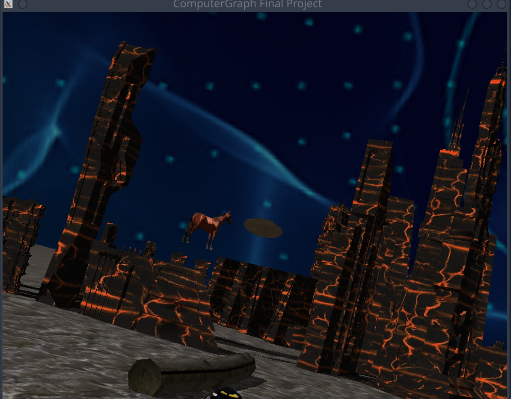

# Computer Graphic Middle Project



## Dependency

stbImage -> For image Loading.

freeglut -> OpenGL Toolkit

OpenGl.


## What inside?

Basic First Person Camera Control.
    - W, S Move Front or Back.
    - Mouse can rotate the view.
Object with texture, and shadow.
Some Cos Wave Rotation Object. 


## How to Build

Notes that this project only test in Windows(VS) and Linux.

```sh
mkdir build 
cd build
cmake ../
cmake --build .
```

After build end, execute ```ComputerGraph``` file to open file.
